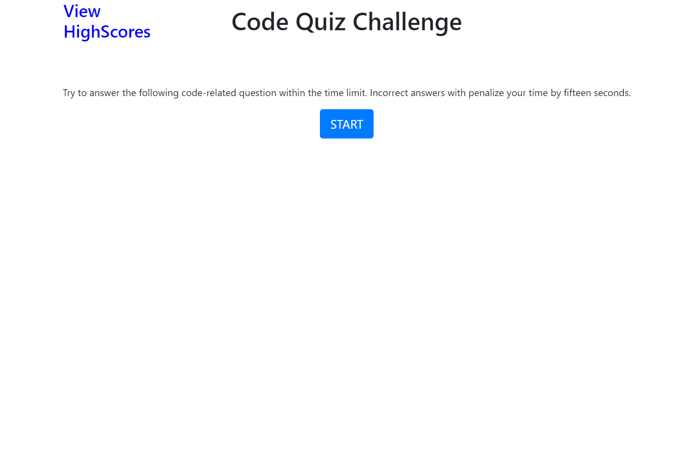

# code_quiz

## Description
In this project I was tasked with making a Code Quiz that features multiple choice question. This project will need to feature the dynamically updated HTML and CSS powered by JavaScript to showcase skills learned in this unit.

## Mock up

The following animation demonstrates the application functionality:

## Deployed Application
Screen Shot 

link to deployed application

link to steps taken to complete this project
